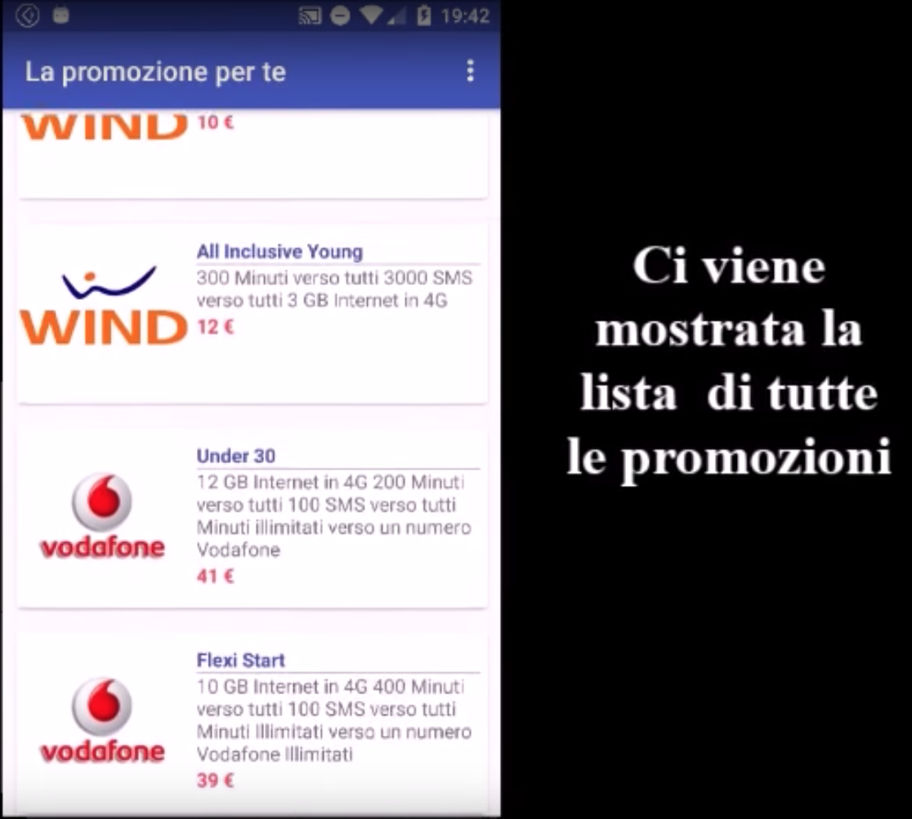
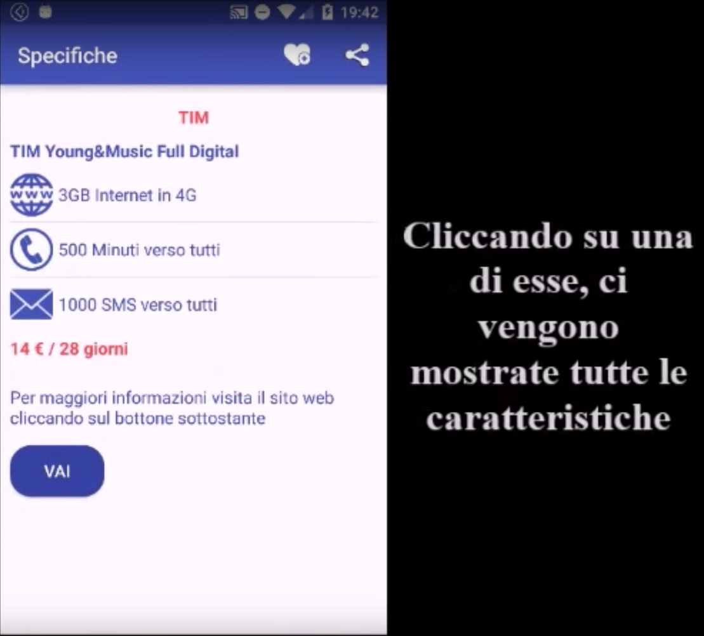
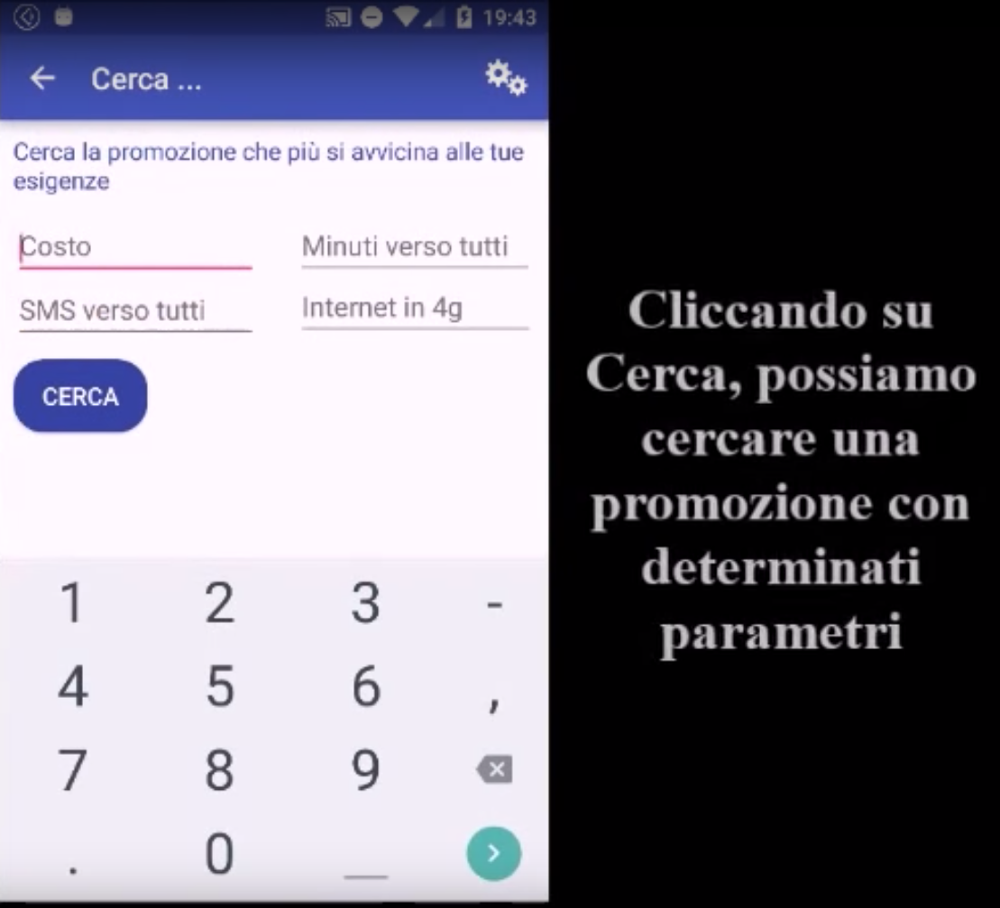

# ProgettoGad
Android application for university project, it takes the data from the server throught GET request (JSON fetching in RestCall class) and print in a cardView object.
This application compares plans of most telephone carrier.

If you click on a item it shows:

You can check plans by carrier:

And then you can find plans for your request:

